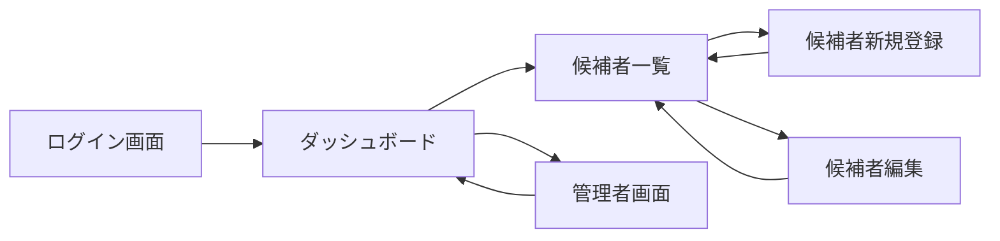
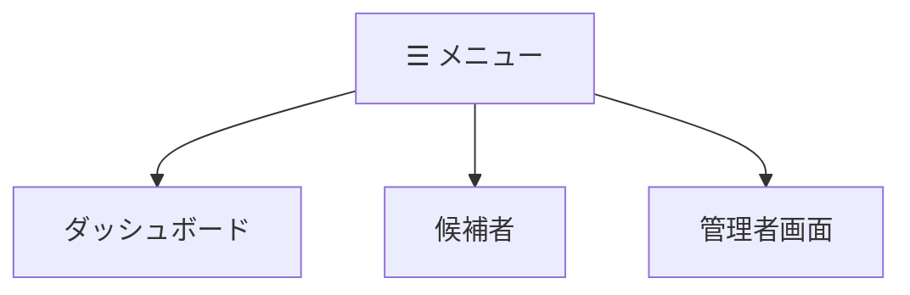
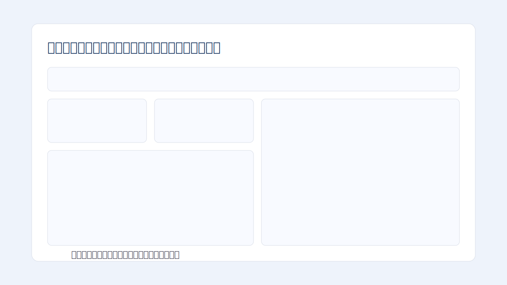
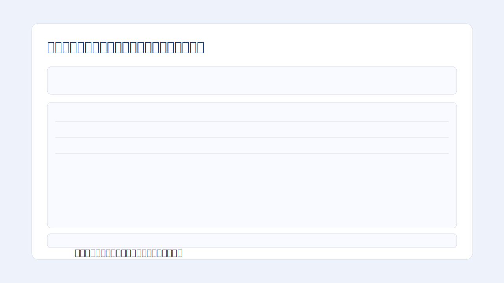
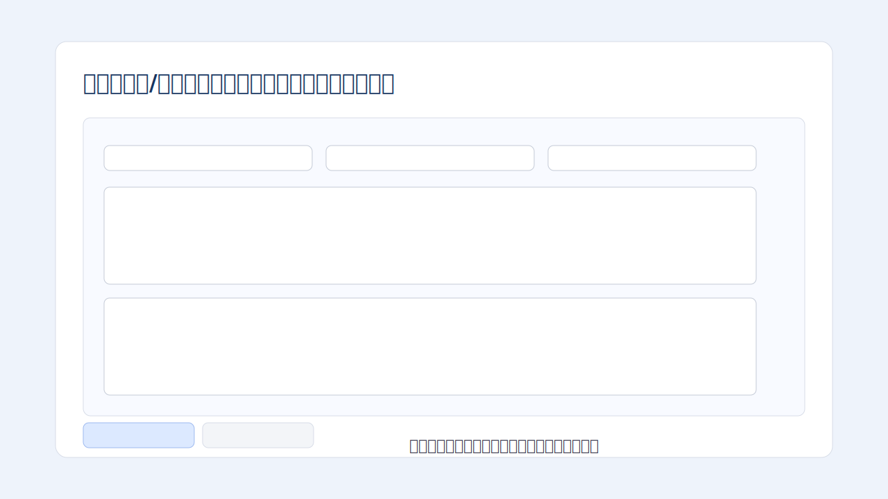
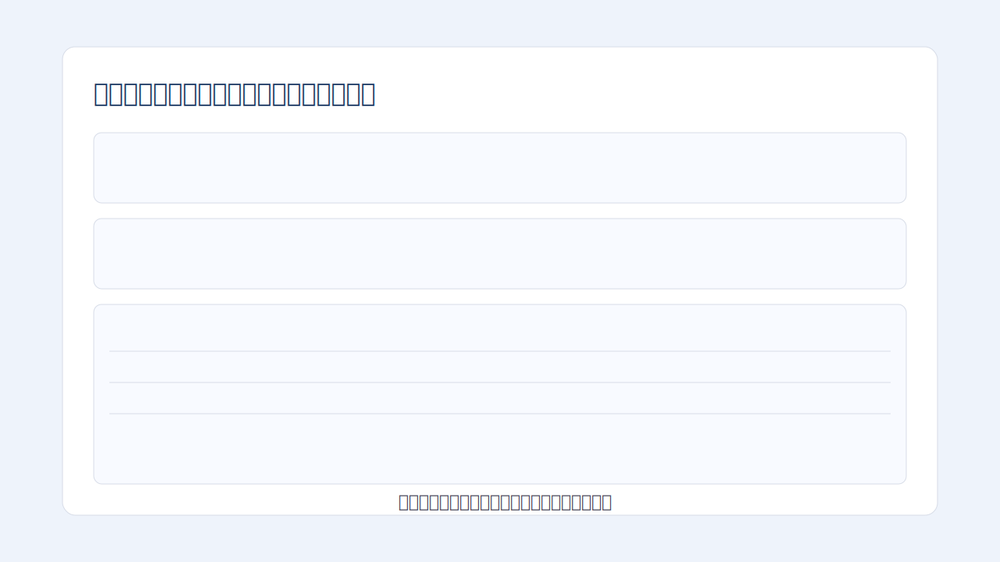
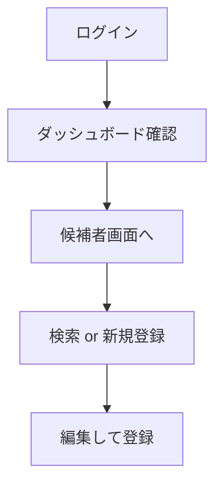

# 採用管理WEBアプリ
## 採用担当者向け 簡易利用マニュアル

---

**文書名**: 採用管理WEBアプリ 採用担当者向け簡易利用マニュアル  
**対象者**: 採用担当者（ITに不慣れな方向け）  
**版数**: v0.1  
**作成日**: 2026-02-09  
**作成者**: 開発チーム  

---

## 0. このマニュアルでできること
このマニュアルを読むと、次の操作ができるようになります。

1. ログインする
2. ダッシュボードを見る（集計期間の切替）
3. 候補者を検索する
4. 候補者を新規登録する
5. 候補者情報を編集する
6. 管理者画面でアカウントを管理する（対象ロールのみ）

---

## 1. まず最初に（準備）
必要なものは次の2つです。

1. アプリのURL（例: `https://recruitment-prototype-five.vercel.app/`）
2. ログイン情報（メールアドレス、パスワード）

初期ログイン例:
- メール: `recruiter1@example.com`
- パスワード: `rec12345`

---

## 2. 画面全体の流れ（図）

---

## 3. ログイン手順
1. ブラウザでURLを開きます。  
2. メールアドレスを入力します。  
3. パスワードを入力します。  
4. `ログイン` ボタンを押します。  
5. ダッシュボード画面が表示されれば成功です。

---

## 4. メニューの使い方（ハンバーガーメニュー）
画面左上の `☰` ボタンから画面を切り替えます。

補足:
- `管理者画面` は、採用担当者と技術部門担当者のみ表示・利用可能です。

---

## 5. ダッシュボードの見方
## 5.1 何が見えるか
- 応募数
- 通過率
- 所要日数（中央値）
- 前年同期比 / 前期比
- 3年推移
- 部/課/グループ別の比較

## 5.2 集計期間の変更
1. `集計期間` を選びます（例: 月次、四半期）。  
2. `絞り込み条件` を選びます（例: 対象月、対象年度）。  
3. 数秒待つと、グラフと数値が更新されます。

---

## 6. 候補者一覧の使い方
## 6.1 検索
次の条件で絞り込みできます。
- 氏名
- メール
- 部門
- ステータス

## 6.2 ソート
各列の見出しをクリックすると、昇順/降順を切り替えできます。

## 6.3 ページ移動
画面下のボタンを使います。
- `先頭`
- `前へ`
- `次へ`
- `末尾`

---

## 7. 候補者を新規登録する
1. 候補者画面で `新規登録` を押します。  
2. 必須項目を入力します。  
3. `登録` を押します。  
4. 候補者一覧に戻り、追加されていることを確認します。

必須項目:
- 氏名
- メールアドレス
- 電話
- 応募職種

---

## 8. 候補者を編集する
1. 候補者一覧で対象行の `編集` を押します。  
2. 内容を修正します。  
3. `登録` を押します。  
4. 候補者一覧に戻り、更新されていることを確認します。

キャンセルしたい場合:
- `キャンセル` を押すと変更は保存されません。

---

## 9. 面接情報の入力ルール（簡易）
- 一次面接担当者: 最大2名
- 最終面接担当者: 最大2名
- 面接官コメント: 必須（運用ルール）
- 採用担当者コメント: 任意

入力時の基本順序:
1. 応募日
2. 一次面接情報
3. 最終面接情報

---

## 10. 管理者画面（採用担当者向け）
できること:
- アカウント追加・更新
- 年度設定変更（4月始まり / 1月始まり / 9月始まり）

注意:
- 年度設定を変更すると、四半期・半期・年次の集計範囲が変わります。

---

## 11. よくある質問（FAQ）
## Q1. ログインできない
確認:
1. メールアドレスの入力ミスがないか
2. パスワードの入力ミスがないか
3. URLが正しいか

## Q2. 画面が更新されない
対応:
1. ブラウザを再読み込み
2. 集計期間・絞り込み条件を選び直す

## Q3. 管理者画面に入れない
理由:
- 権限対象外ロールの可能性があります（採用担当者/技術部門担当者のみ）。

---

## 12. 困ったときの連絡テンプレート
問い合わせ時は、次を添えてください。

1. 発生日時
2. 操作した画面名
3. 実施手順（何を押したか）
4. 表示されたメッセージ
5. 可能ならスクリーンショット

---

## 付録A. 1分で分かる基本操作

## 付録B. スクリーンショット差し替え方法
このマニュアルは、画像を差し替えて本番配布できます。

1. `docs/manual-images/` の各SVGを、同名のPNG/JPGに置き換える  
2. 実画面をキャプチャして、対応するファイル名で保存する  
3. Markdownプレビューで表示確認する  

対象ファイル:
- `manual-images/login-screen.svg`
- `manual-images/dashboard-screen.svg`
- `manual-images/candidates-screen.svg`
- `manual-images/candidate-form-screen.svg`
- `manual-images/admin-screen.svg`
